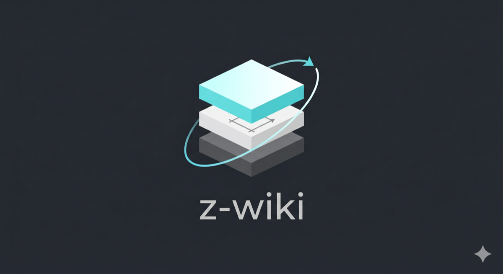

<div align="center">



# z-wiki

**A personal, LLM-maintained knowledge wiki template for Claude Code.**

*Clone → drop sources → ask questions → watch knowledge compound.*

[](LICENSE)
[](https://claude.ai/code)
[](https://obsidian.md)
[](#status)
[](#contributing)

</div>

---

## Why

Most notes rot. You read, you highlight, you forget. RAG systems over raw documents re-derive answers from scratch every query; nothing persists, nothing compounds.

**z-wiki flips that.** An LLM agent (Claude Code) reads your sources once, compiles them into a cross-referenced markdown wiki, and saves every answered question back as a new page. The next query has strictly more to work with. The vault appreciates with use, not just with ingestion.

Inspired by [Andrej Karpathy's LLM knowledge bases](https://x.com/karpathy/) and [Shann Holmberg's AI knowledge layer](https://x.com/shannholmberg/). Zero content bundled — you bring the sources.

---

## How it works

```
                  ┌──────────────────────────────┐
                  │   CLAUDE.md  (operating spec)│
                  └──────────────┬───────────────┘
                                 │  loaded every session
        ┌───────────────┐        ▼        ┌────────────────┐
        │     raw/      │    ┌───────┐    │     wiki/      │
        │ articles,     │───▶│Claude │───▶│ sources,       │
        │ papers,       │    │ Code  │    │ concepts,      │
        │ transcripts   │    └───┬───┘    │ entities,      │
        │ (you own)     │        │        │ outputs        │
        └───────────────┘        │        │ (Claude owns)  │
               ▲                 │        └────────┬───────┘
               │                 │                 │
               │ /wiki-add       │ /wiki-query     │ filing loop
               │                 ▼                 │
               │         ┌───────────────┐         │
               └─────────│ your question │◀────────┘
                         └───────────────┘
```

**Three layers, four core operations:**

| Layer | Contents | Owner |
|---|---|---|
| `raw/` | Source material you drop in (articles, papers, transcripts) | **You** — immutable once placed |
| `wiki/` | LLM-authored summaries, concepts, entities, outputs | **Claude Code** |
| `CLAUDE.md` | The spec that controls how Claude writes `wiki/` | **Both** — co-evolved |

- **`/wiki-ingest`** — compile raw into wiki pages with cross-referenced wikilinks
- **`/wiki-query`** — answer questions from the wiki; file the answer back as a new page
- **`/wiki-lint`** — audit the wiki for broken links, drift, promotion candidates
- **`/wiki-compile`** — rebuild the master index from the filesystem

The **filing loop** — every answered query saved back as a citable page — is what makes knowledge compound.

---

## Quickstart

```bash
git clone https://github.com/<your-username>/z-wiki.git my-wiki
cd my-wiki
claude
```

Then, inside Claude Code:

```
/wiki-init                                    # 1. Interactive topic setup
/wiki-add https://some.url/article            # 2. Fetch + place a source
/wiki-ingest                                  # 3. Compile into wiki pages
/wiki-query what does source X argue?         # 4. Ask a question, get a cited answer
/wiki-status                                  # 5. Quick vault summary
```

Open the folder as an Obsidian vault to browse the graph and read pages.

---

## Example session

After ingesting a single paper (e.g., Ongaro 2014's Raft paper), this is what `/wiki-query` produces:

```
> /wiki-query what does Raft solve that Paxos struggled with?

Reading wiki/index.md... shortlisting candidates
Reading wiki/sources/ongaro-2014-raft.md
Reading wiki/concepts/paxos.md
Reading wiki/concepts/leader-election.md

Short answer:
Not correctness, not efficiency — implementability. Paxos and Raft
produce equivalent guarantees at comparable cost. What Raft solves
is that Paxos's presentation left too many corner cases, so
implementations consistently diverged from the published algorithm.
Raft's decomposition and structural constraints collapse that space.

Sources: [[ongaro-2014-raft]], [[paxos]], [[leader-election]]
→ Filed as wiki/outputs/what-does-raft-solve-that-paxos-struggled-with.md
```

The filed answer joins the wiki. The next related query cites it.

---

## Features

- 🗂  **Plain-markdown substrate.** No database, no embeddings, no vector store. Renders on GitHub, portable forever.
- 🔗 **Cross-referenced wikilinks.** Every concept and entity gets its own page; Obsidian's graph view shows the emergent structure.
- 🧠 **Compiled, not retrieved.** Sources are read once and compiled into summaries + concept + entity pages. Queries run against the compiled wiki, not raw documents.
- ♾  **Filing loop.** Every answered query is saved as a wiki page the next query can cite. Knowledge compounds with use.
- 🎯 **Stub promotion, two-axis.** Concepts are promoted from stub → full page automatically when they cross a source-count OR inbound-reference threshold.
- ⚠️  **Contradiction callouts.** When sources disagree, Claude inserts an inline `> [!warning]` callout citing both sides. Never silently reconciles.
- 🕐 **`last_seen` freshness.** Every page tracks the last date any operation read, cited, or wrote it. Stale content surfaces in lint reports.
- 📐 **Graduation discipline.** `docs/GUIDE.md` §15 documents 6 named triggers for when to unlock v2 features (hybrid search, automation). Don't scale on intuition.
- 🔌 **Five vendored Obsidian skills.** `obsidian-markdown`, `obsidian-bases`, `json-canvas`, `obsidian-cli`, `defuddle` — MIT-licensed from [kepano/obsidian-skills](https://github.com/kepano/obsidian-skills). Auto-discovered by Claude Code.
- 🧩 **Extensible.** `/wiki-new-template` scaffolds new source-type templates and wires them into the ingest pipeline.

---

## What this is NOT

Setting expectations explicitly:

- **Not a pre-built knowledge base.** Zero content bundled. You bring the sources.
- **Not a search engine.** Navigation is `wiki/index.md` + `[[wikilinks]]`. No embeddings at the default scale.
- **Not a replacement for reading.** It compounds what you've *already read* — doesn't let you skip reading.
- **Not a chat interface.** Every query produces a filed, cited, durable answer — not ephemeral conversation.
- **Not a hosted service.** Runs locally against your Claude Code subscription. Your data never leaves your disk unless you push it.
- **Not designed for 10,000+ sources out of the box.** See `docs/GUIDE.md` §15 for the scaling ladder.

---

## Slash commands

**Core lifecycle** (the four canonical operations):

| Command | What it does |
|---|---|
| `/wiki-ingest [path]` | Compile new files from `raw/` into wiki pages |
| `/wiki-query <question>` | Answer a question from the compiled wiki, file the answer back |
| `/wiki-lint` | Audit the wiki; auto-fix what's fixable, report the rest |
| `/wiki-compile` | Regenerate `wiki/index.md` from the filesystem |

**Helpers** (quality-of-life commands):

| Command | What it does |
|---|---|
| `/wiki-init` | First-run: topic-setup wizard + directory scaffold. Re-runs: verification only. |
| `/wiki-add <url-or-path>` | Fetch a URL or copy a file into `raw/`; optionally ingest immediately |
| `/wiki-status` | Read-only vault summary — counts, stubs near promotion, recent activity |
| `/wiki-new-template <name>` | Scaffold a new template and wire it into the ingest pipeline |

All eight commands read `CLAUDE.md` first. None of them touch `raw/` existing files. Only three (`/wiki-init`, `/wiki-add`, `/wiki-new-template`) may write to `CLAUDE.md` or create new files in `raw/`.

---

## Installation

**Prerequisites:**

| Tool | Version | Purpose |
|---|---|---|
| [Claude Code](https://claude.ai/code) | any recent | Runs the slash commands |
| [Obsidian](https://obsidian.md) | ≥ 1.4 | Reading surface (MathJax, graph view, Properties) |
| `git` | any | History and multi-machine sync |
| `defuddle` *(optional)* | any | Clean web-page extraction; `npm install -g defuddle` |

**Install:**

```bash
git clone https://github.com/<your-username>/z-wiki.git my-wiki
cd my-wiki
```

Open the folder in Obsidian (**File → Open folder as vault**). Start a Claude Code session in the vault root (`claude`). Run `/wiki-init`.

macOS and Linux paths are assumed. Windows works via WSL.

---

## Documentation

- **[docs/GUIDE.md](docs/GUIDE.md)** — step-by-step walkthroughs, file conventions, troubleshooting, graduation discipline
- **[CLAUDE.md](CLAUDE.md)** — the operating spec (loaded into every Claude Code session)
- **[.claude/commands/](.claude/commands/)** — the eight slash commands
- **[templates/](templates/)** — the seven page templates Claude follows when creating wiki pages
- **[docs/obsidian-skills-provenance.md](docs/obsidian-skills-provenance.md)** — provenance of the five vendored Obsidian skills

---

## Status

**Beta.** The core four operations (ingest / query / lint / compile) are stable and have been dogfooded on a real vault with multiple sources, multi-source synthesis queries, and cross-page lint passes. The four helper commands (`init`, `add`, `status`, `new-template`) have been end-to-end tested against a scratch vault and a real URL (`defuddle` path validated).

Known limits:

- **Scale ceiling** around low-hundreds of sources. Past ~500 pages, the single `wiki/index.md` navigation approach needs to become hierarchical (pattern documented in `docs/GUIDE.md` §15).
- **No built-in retrieval tool.** Past ~2,000 sources, you'll want BM25 + embeddings + rerank via an MCP tool. Graduation trigger documented.
- **Windows is WSL-only.** Path handling assumes POSIX.

If you hit an edge case, [open an issue](../../issues). If a template doesn't fit your source type, use `/wiki-new-template` or propose one via a PR.

---

## Roadmap

The template is deliberately minimal. The **graduation discipline** in `docs/GUIDE.md` §15 defines specific metric thresholds for when to unlock each of these; nothing ships until its threshold fires.

- [ ] Hybrid search (BM25 + embeddings + rerank via MCP) — unlock when sources > 50 or `grep wiki/` > 2s
- [ ] Hierarchical index (per-section `_index.md` becomes load-bearing) — unlock when `wiki/index.md` > 500 lines or 10k tokens
- [ ] Confidence scoring / supersession — unlock when ≥5 pages have open contradictions > 2 weeks
- [ ] Two-model validation — unlock on any confirmed hallucination
- [ ] Knowledge-graph layer (typed edges in `related:` frontmatter) — unlock when ≥3 queries/week need graph traversal
- [ ] Scheduled automation (cron `/wiki-ingest`) — unlock when manual ingest ≥5×/week for 2 weeks

---

## Contributing

Contributions welcome — especially from people running z-wiki on their own vault and hitting sharp edges.

**Good first PRs:**
- New templates for source types not covered (voice memos, meeting minutes, research interviews)
- Troubleshooting entries in `docs/GUIDE.md` §12
- Documentation fixes or clarifications
- Bug fixes to slash-command behavior

**Before you PR:**

1. Open an issue first for anything larger than a doc/typo fix — lets us align on scope before you spend time.
2. Run the changed commands against a scratch vault (not your real one). End-to-end smoke test at minimum: `/wiki-init` → `/wiki-add` → `/wiki-ingest` → `/wiki-query` → `/wiki-status`.
3. Don't expand `CLAUDE.md` without clear motivation — every line is loaded into every session. Token discipline matters.
4. Don't add retrieval infrastructure (embeddings, vector stores) without hitting the graduation trigger in `docs/GUIDE.md` §15. Premature optimization is the main failure mode for this architecture.

**Not in scope:**

- Bundling content (sources, concept pages). The template stays zero-content by design.
- Alternative storage backends. Plain markdown is non-negotiable.
- Features that only work in proprietary clients. Everything must degrade gracefully to `cat wiki/*.md`.

---

## FAQ

**Do I need a Claude subscription?**
Yes. The template is designed for [Claude Code](https://claude.ai/code). Any plan that includes Claude Code works.

**Can I use a different LLM / agent?**
In principle, any markdown-aware agent that can read `CLAUDE.md` and execute bash + file I/O. In practice, the slash commands are specific to Claude Code's runtime. Porting would require adapting the command format.

**Can I keep my wiki private?**
Yes — it's just a git repo. Use a private GitHub repo, or never push. Everything lives on your disk.

**Does Obsidian call home?**
Obsidian is local-first and doesn't send content anywhere by default. Claude Code sends the pages it loads to Anthropic for inference; that's the standard API flow.

**How is this different from Notion AI / Mem / Reflect?**
Those are hosted services with proprietary storage. z-wiki is plain markdown files on your disk, readable by any tool, versioned by git, and the compilation is deterministic given the spec.

**Can I run this on mobile?**
Obsidian works on iOS/Android for *reading* the vault. Claude Code is desktop-only at time of writing, so ingest/query requires a laptop.

---

## Acknowledgments

- **Andrej Karpathy** — ["LLM knowledge bases"](https://x.com/karpathy/). The original raw-sources → compiled-wiki → query → file-back architecture.
- **Shann Holmberg** — ["The AI Knowledge Layer"](https://x.com/shannholmberg/). The framing as agent infrastructure and the two-layer extension.
- **Steph Ango (kepano)** — [kepano/obsidian-skills](https://github.com/kepano/obsidian-skills). The five vendored skills that teach Claude to write idiomatic Obsidian markdown, Bases, and Canvas files.
- **Anthropic** — [Claude Code](https://claude.ai/code). The runtime this template is built around.

---

## License

[MIT](LICENSE). Vendored skills under `.claude/skills/` are MIT from [kepano/obsidian-skills](https://github.com/kepano/obsidian-skills); see [docs/obsidian-skills-provenance.md](docs/obsidian-skills-provenance.md) for provenance.

---

<div align="center">

**[⭐ Star this repo](../../stargazers)** if z-wiki is useful to you — helps others find it.

Found a bug or want to suggest something? [Open an issue](../../issues).

</div>
